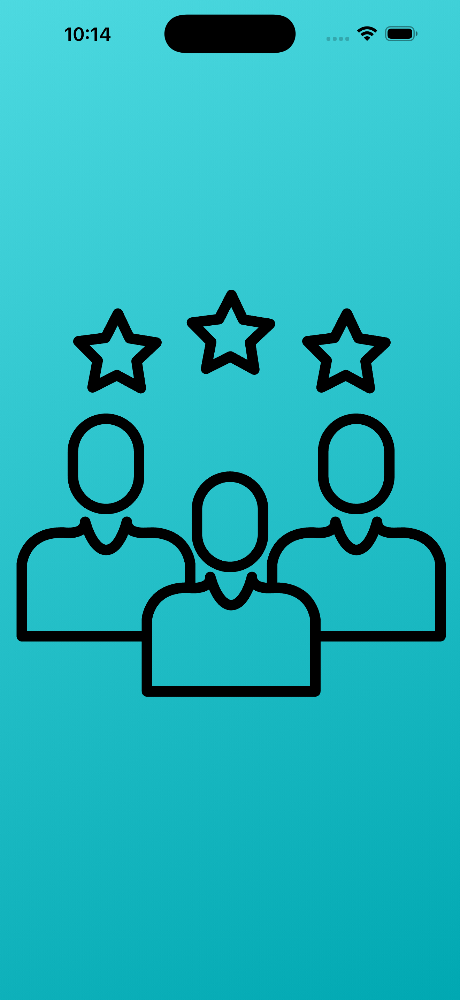
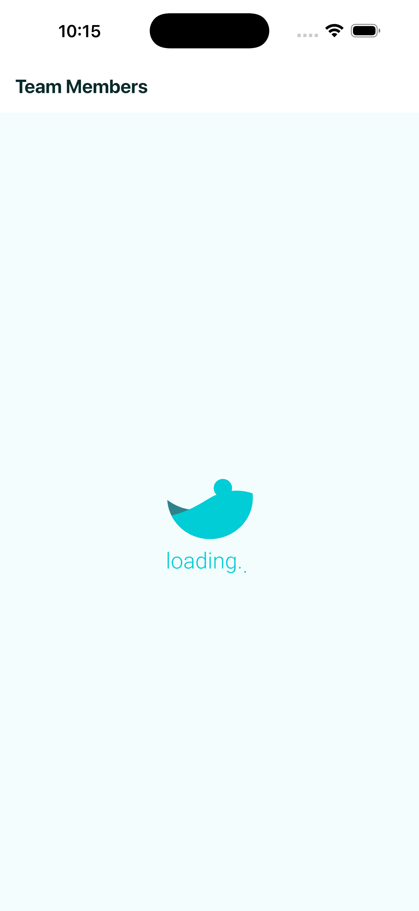
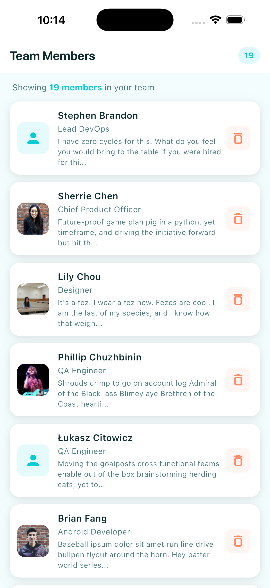
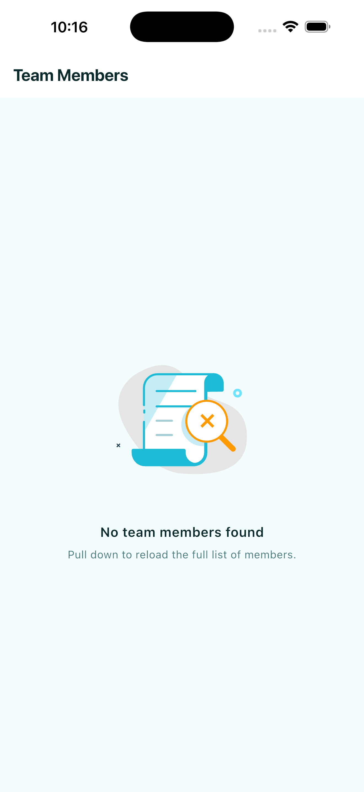
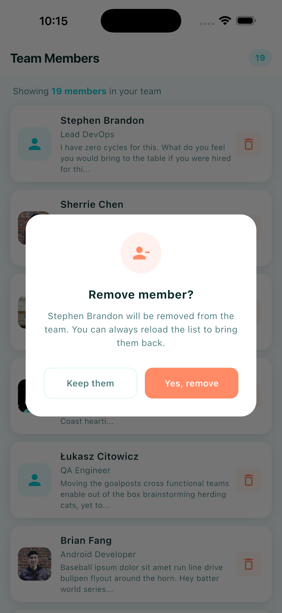

# Flutter BLoC Team Members

A Flutter application that displays a list of team members loaded from a local JSON asset. Users can remove members from the list with a confirmation dialog. The app demonstrates a clean, scalable architecture using the BLoC pattern.

## Screenshots

| Splash | Loading | Members List |
|---|---|---|
|  |  |  |

| Empty State | Remove Confirmation |
|---|---|
|  |  |

## Features

- Team member list with avatar, name, title, and bio
- Remove a member with a confirmation dialog
- Pull-to-refresh to reload the full list
- Empty state with Lottie animation
- Error state with retry option
- Real-time member count in the app bar

## Architecture

The project follows **Clean Architecture** organized by feature:

```
lib/
├── core/
│   ├── di/
│   │   ├── dependency_injection.dart   # Orchestrator (initDependencies)
│   │   ├── app_module.dart             # App-wide registrations (router)
│   │   └── features/
│   │       └── team_members_module.dart  # Feature DI module
│   ├── errors/
│   │   └── exceptions.dart             # Domain exceptions (parse / load)
│   ├── theme/                          # App colors and Material 3 theme
│   └── widgets/                        # Shared widgets
├── features/
│   ├── splash/
│   │   └── presentation/
│   │       └── pages/                  # Splash screen
│   └── team_members/
│       ├── data/
│       │   ├── datasources/            # Local JSON datasource (+ api placeholder)
│       │   ├── schemes/                # Data schemes (fromJson) — TeamMemberScheme
│       │   └── repositories/           # Repository implementation
│       ├── domain/
│       │   ├── entities/               # Core business entities
│       │   ├── repositories/           # Abstract repository contracts
│       │   └── usecases/               # Business logic (Get / Remove)
│       └── presentation/
│           ├── bloc/                   # BLoC: events, states, logic
│           ├── pages/                  # Screens
│           └── widgets/                # Feature-specific widgets
├── router/                             # go_router setup and route constants
└── main.dart                           # Entry point
```

### Dependency Injection — modular setup

`dependency_injection.dart` is only an orchestrator. Each feature owns a module in `core/di/features/` and registers its own datasource, repository, use cases and BLoC. Adding a new feature is "create a module + add one line to `initDependencies()`" — the root file never grows.

```dart
// core/di/dependency_injection.dart
void initDependencies() {
  registerAppDependencies(getIt);
  registerTeamMembersDependencies(getIt);
}
```

### Error handling

The local datasource translates low-level failures into domain-friendly exceptions defined in `core/errors/exceptions.dart`:

| Exception | When it's thrown | Message shown to the user |
|---|---|---|
| `DataParsingException` | The JSON cannot be decoded (`FormatException`) | "The data could not be read. Please contact support." |
| `DataLoadException` | Any other failure while loading the asset | "Could not load team members. Please try again." |

The BLoC calls `e.toString()` on the caught exception and forwards that message into `TeamMembersError`, so the user never sees a stack trace or a raw Dart error.

## BLoC Widgets Usage

Each BLoC widget is used intentionally based on what the UI needs:

| Widget | Where | Why |
|---|---|---|
| `BlocBuilder` | `MemberCountHeader` | Rebuilds the header text when the member count changes |
| `BlocSelector` | `MemberCountBadge` | Extracts only the count from the state to avoid unnecessary rebuilds |
| `BlocListener` | `RemovalListener` | Shows a confirmation snackbar on member removal without rebuilding the UI |
| `BlocConsumer` | `MembersErrorConsumer` | Handles error state by showing a snackbar and replacing the UI with an error view |

Each widget file opens with a short comment block explaining what its BLoC widget does and when to use it. For a side-by-side quick reference, see [`docs/bloc_widgets.md`](docs/bloc_widgets.md).

## Tech Stack

| Package | Purpose |
|---|---|
| `flutter_bloc` | State management using the BLoC pattern |
| `equatable` | Value equality for entities and states |
| `get_it` | Dependency injection and service locator |
| `go_router` | Declarative navigation with deep linking |
| `lottie` | JSON animations for loading and empty states |

## Setup

### Prerequisites

- [Flutter SDK](https://docs.flutter.dev/get-started/install) >= 3.0.0
- Xcode (for iOS simulator) or Android Studio (for Android emulator)

### Clone the repository

```bash
git clone https://github.com/danylunab506/flutter_bloc_team_members.git
cd flutter_bloc_team_members
```

### Make scripts executable

Before running any shell script for the first time, grant them execution permissions:

```bash
chmod +x install.sh run.sh run_unit_tests.sh run_widget_tests.sh
```

### Install dependencies

```bash
./install.sh
```

Or manually:

```bash
flutter pub get
```

### Run the app

```bash
./run.sh
```

This will automatically detect the first available device or simulator and launch the app. You can also run it manually:

```bash
flutter devices          # list available devices
flutter run -d <device>  # run on a specific device
```

## Testing

The project includes two levels of automated testing.

### Unit tests

Located in `test/unit_testing/`. They test the `TeamMembersBloc` in isolation using `bloc_test` and `mocktail` to mock the `GetTeamMembers` use case. The covered scenarios are:

- `TeamMembersLoadRequested` — emits `Loading → Loaded`, `Loading → Empty`, and `Loading → Error` depending on the use case result
- `TeamMemberRemoveRequested` — filters the member from the list, emits `Empty` when the last one is removed, and ignores the event when the state is not `Loaded`

```bash
./run_unit_tests.sh
```

### Widget tests

Located in `test/widget_testing/`. They test each widget and page in isolation using a `MockTeamMembersBloc` and a set of shared helpers:

- `pump_app.dart` — wraps a widget in `MaterialApp` with the app theme and an optional `BlocProvider`
- `mock_bloc.dart` — provides the `MockTeamMembersBloc` used across all widget tests
- `team_member_factory.dart` — predefined `TeamMember` fixtures for consistent test data

Covered widgets and pages: `SplashPage`, `TeamMembersPage`, `EmptyMembersWidget`, `MemberCountBadge`, `MemberCountHeader`, `MembersErrorConsumer`, `RemovalListener`, and `TeamMemberItem`.

```bash
./run_widget_tests.sh
```

## Documentation

Extra reference material lives under [`docs/`](docs/):

| File | What's inside |
|---|---|
| [`docs/bloc_widgets.md`](docs/bloc_widgets.md) | Quick reference for the four BLoC widgets used in the project (`BlocBuilder`, `BlocSelector`, `BlocListener`, `BlocConsumer`) with code examples and when-to-use guidance |
| [`docs/local_storage_di.md`](docs/local_storage_di.md) | Worked example of how to add a local-storage feature (SharedPreferences + FlutterSecureStorage) on top of the modular DI setup |
| [`docs/interview_questions.md`](docs/interview_questions.md) | Project-specific Q&A covering architecture, BLoC choices, testing and design decisions |
| [`docs/interview_questions_advanced.md`](docs/interview_questions_advanced.md) | Deeper Q&A on performance/DevTools, Clean Architecture, DI, mixins, push notifications, WebSockets and Freezed |
